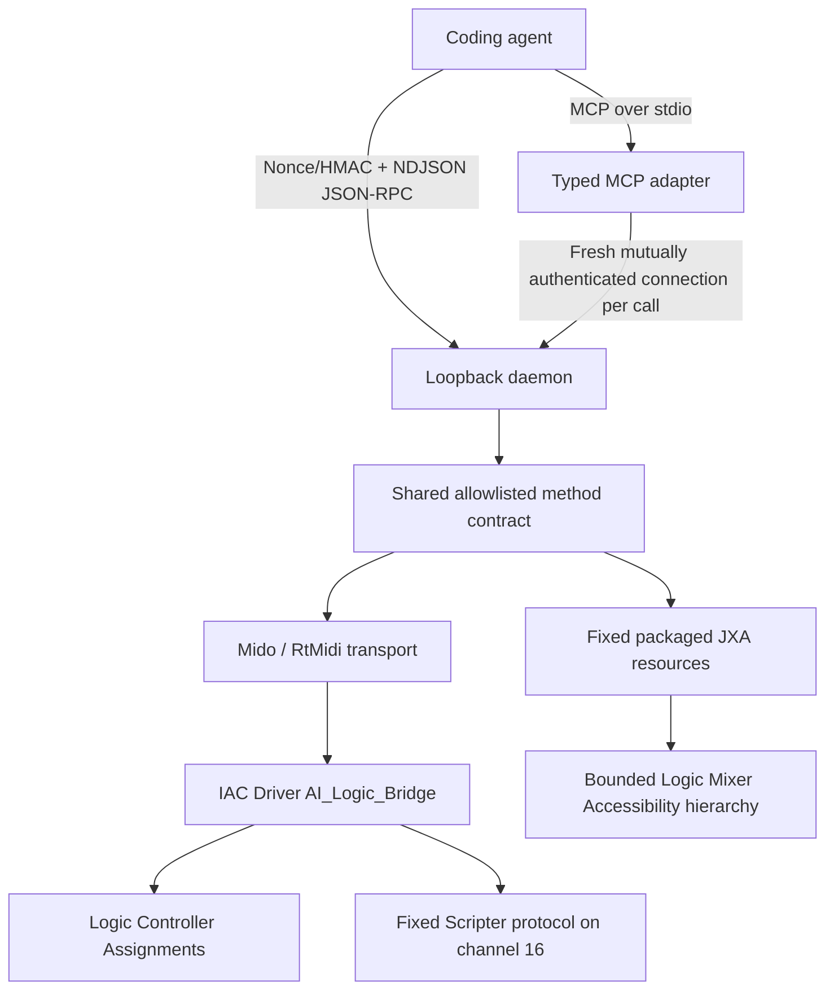

# Architecture

This bridge is a local control plane for Apple Logic Pro. It gives coding agents
a typed, discoverable interface over the public mechanisms that Logic and macOS
actually provide. It does not claim a hidden Logic API, complete project-state
readback, or universal control of every Logic feature.

See [Setup](SETUP.md) for operator configuration, [Security](SECURITY.md) for the
threat model, [Scripter](SCRIPTER.md) for the software-instrument plug-in path,
[MCP clients](MCP_CLIENTS.md) for agent integration, and
[Live validation](LIVE_VALIDATION.md) for evidence and recovery rules.

## Authority and trust boundaries

The authenticated, loopback-only daemon is the sole command authority. JSON-RPC
clients connect to it directly. The MCP stdio process is only an adapter: it
opens an authenticated daemon connection for each request and never opens MIDI,
Accessibility, or Logic resources itself.



Loopback networking and the IAC bus are routing boundaries, not authentication
boundaries. Authorization comes from the daemon authentication secret, the validated
machine-local configuration, opaque allowlisted IDs, and method-specific input
validation.

The token is a shared HMAC secret, not a bearer value on the wire. Every TCP
connection performs a fresh client-nonce/server-nonce exchange. The daemon proves
secret possession before the client releases method or parameter data; the
client then proves possession with an HMAC bound to both nonces and the canonical
request. One connection carries at most one request.

## Transport matrix

| Surface | Intended use | Public caller supplies | Evidence limit |
| --- | --- | --- | --- |
| MIDI CC | Faders, toggles, and learned controls | Opaque action ID and, when declared, a bounded value | Delivery only; normally ends `unknown` |
| MIDI note | Fixed trigger actions | Opaque action ID | Note-on/note-off delivery only |
| MIDI SysEx | Fixed or one-slot parameterized device messages | Opaque action ID and only the configured value mode | Delivery only; payload bytes remain private |
| Accessibility/JXA | Exact allowlisted `.cst` load and scoped Mixer inspection | Opaque preset/target IDs and exact confirmation for mutation | Only approved visible evidence can be observed or scoped-verified |
| Scripter | Two learned Retro Synth targets on a software-instrument strip | Opaque parameter ID and normalized value | Output-only; no Scripter or plug-in acknowledgement |
| MCP stdio | Agent discovery and typed access | Tool arguments equivalent to daemon methods | Preserves daemon lifecycle and errors |

No command silently falls back from one transport to a broader one.

## Public command model

The method registry is the canonical public contract. JSON-RPC schemas,
capability discovery, and MCP wrappers must remain in parity. Public callers may
select only named domain operations and opaque IDs. They cannot provide:

- shell commands or subprocess arguments;
- AppleScript, JXA, or Scripter source;
- Accessibility selectors, coordinates, menu paths, or raw hierarchy dumps;
- filesystem paths, URLs, or arbitrary `.cst` filenames;
- MIDI channels, controls, notes, or raw SysEx bytes.

The bridge supports selected-track volume and mute, declarative configured MIDI
actions, fixed Scripter parameters, bounded Mixer inspection, and allowlisted
channel-strip setting loads. Availability is reported per operation rather than
assuming that a configured feature is currently usable.

## Lifecycle and evidence model

Every mutation uses an ordered event history:

1. `requested` — the daemon accepted a request into validation and authorization.
2. `dispatched` — the selected transport accepted the operation.
3. `observed` — an attributable post-dispatch signal was visible.
4. `verified` — a separate approved observer proved a named, limited postcondition.
5. `unknown` — the bridge cannot prove the resulting Logic state.

The states are evidence levels, not a generic success ladder. A MIDI send usually
produces `requested`, `dispatched`, `unknown`. A `.cst` load can be `observed`
when its attributable popup transition completes, but can become `verified` only
when a separate bounded inspection matches the configured visible plug-in
signature. That verification scope is `mixer_plugin_signature`; it does not prove
hidden parameters, routing, `.cst` byte equivalence, project save state, or all
Logic source state.

A timeout, cancellation, disconnect, or partial failure after dispatch remains
ambiguous. The daemon and clients must not convert it into safe-to-retry success
or failure.

## Declarative MIDI path

Configuration defines each action's kind, fixed route, and value mode. A CC
action emits no more than two messages. A note trigger emits exactly one note-on
and one note-off while holding the transport lock. A SysEx definition contains
1–256 seven-bit data bytes; Mido provides framing, and at most one configured
payload position may accept a normalized or absolute value.

The IAC output name must match exactly. Logic then interprets the messages through
operator-created Controller Assignments or a deliberately routed
software-instrument track. The bridge cannot read Controller Assignment state, so
operator configuration may remain `unverifiable` even while dispatch is available.

## Accessibility path

The `.cst` path uses only the fixed resources documented in
[the packaged script contract](../bridge_scripts/README.md). The daemon resolves
opaque IDs to locally configured data, validates the preset file and exact target,
then invokes descriptor-verified, SHA-256-pinned cached JXA bytes over `osascript`
standard input with a sanitized environment and an outer process deadline. A
validated JXA pathname is never passed to `osascript` for reopening.

The resolver requires exactly one standalone Mixer, one bounded Mixer layout,
one exact strip whose configured index and name agree, and one direct Setting
button. It uses role- and structure-based resolution with hard traversal caps;
it never uses screen coordinates or whole-application recursive scans. One
global uniqueness pass is followed only by configured-strip drift checks. Target
identity is rechecked immediately before mutation. Ambiguity, drift, timeout, or
duplicate evidence fails closed. Stable pre/post preset identity and ctime checks
detect replacement, but Logic's menu cannot load from an already-open descriptor,
so same-user races are detected after dispatch rather than prevented.

Loading a channel-strip setting is destructive to the target strip. The shared
confirmation value is exactly:

```text
load <preset_id> into <target_id> in disposable project
```

The IDs are the same opaque IDs shown to the operator immediately before the
request. Cancel, a malformed phrase, or stale target evidence dispatches nothing.

## Scripter path

Scripter is an additive MIDI-FX option for a software-instrument strip. Protocol
v1 sends channel 16 CC102 and CC103 to one reviewed fixed script, which converts
them to TargetEvent writes for two manually learned Retro Synth parameters. It is
not available on an audio strip such as Audio 2 and is not an arbitrary JavaScript
execution surface. See [Scripter setup and limits](SCRIPTER.md).

## MCP path

The MCP adapter uses stdio and the stable v1 Python SDK line. The client that
launches the process is the stdio trust boundary; the daemon token still enforces
mutation authorization. Standard output is reserved for MCP protocol frames, and
bounded diagnostics go to standard error without credentials or private paths.

Each tool call uses one new daemon connection, sends one authenticated request,
reads one matching response, and closes. This prevents a late response from a
timed-out or canceled request from being consumed by a later call. The adapter
does not start the daemon and does not provide a second command authority.

## Explicit non-goals

The bridge does not:

- modify, inject into, re-sign, or patch Logic Pro;
- bypass or edit macOS Transparency, Consent, and Control permissions;
- mutate undocumented Logic project plists or `.cst` bytes;
- depend on third-party GUI automation applications;
- expose a remote, HTTP, WebSocket, SSE, or multi-user service;
- offer arbitrary Scripter runtime injection;
- claim comprehensive Logic project-state readback;
- save over a non-disposable user project.

## Compatibility posture

Python 3.11 or newer is mandatory. Accessibility selectors are version-sensitive,
so every live record must include the macOS and Logic versions used. A selector
change is handled by tightening and retesting the fixed structural contract, not
by adding coordinates or broad selectors.
